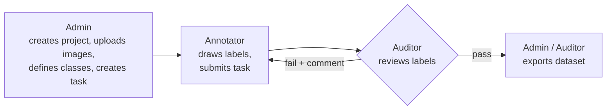
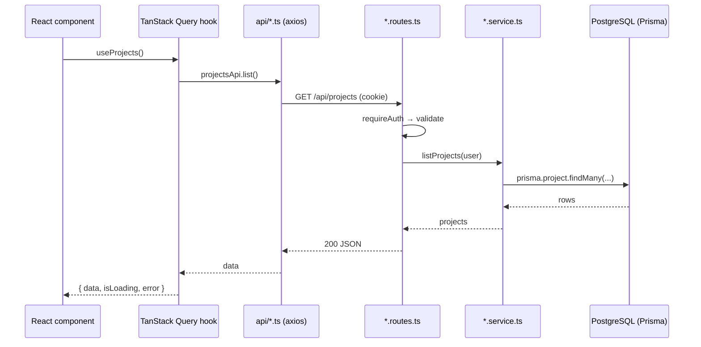
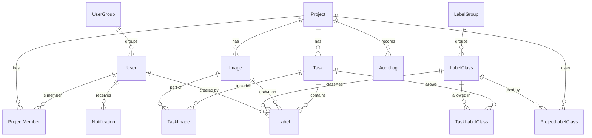
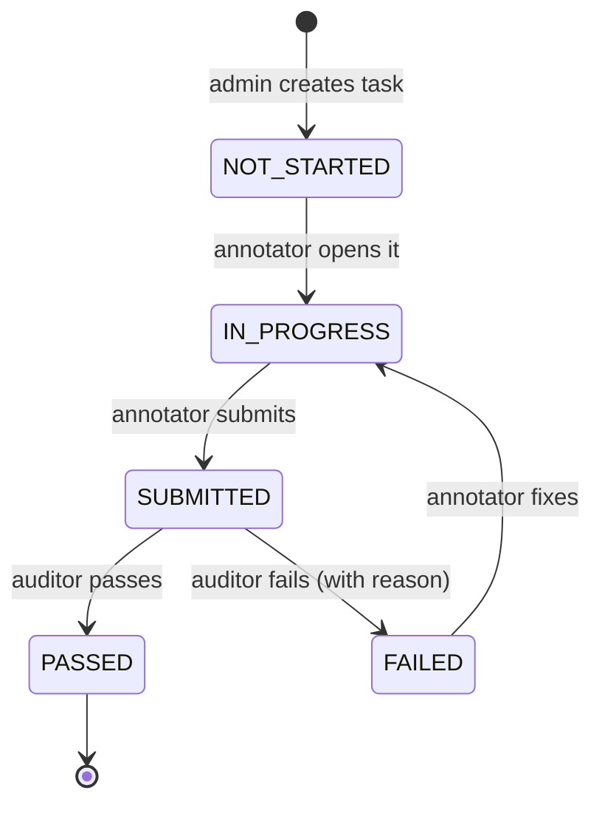

# GeoAnnotator — Learn-by-Rebuilding Plan

This repository is a **clean rebuild** of GeoAnnotator v2 (the original lives in
`gamedev20261/test2` and is used only as a reference, never modified).

The goal is not just a working app. It is for **you to understand every part of it**:
each module comes with a lesson, a Postman collection to test the API yourself, and
a "trace a click" walkthrough from the button on screen to the row in the database.

---

## 1. What the app does (in one paragraph)

GeoAnnotator is a web app for **labelling large satellite/aerial images**.
An **Admin** creates projects, uploads images, defines label classes (e.g. *building*,
*road*, *tree*) and creates **tasks** that assign images to an **Annotator** and an
**Auditor**. The Annotator draws shapes (boxes, polygons, points) on the images and
submits the task. The Auditor reviews every label, approves or rejects it with a
comment, and passes or fails the task. Failed tasks go back to the Annotator.
Passed tasks can be **exported** as machine-learning datasets (YOLO / COCO / VOC).



---

## 2. The three portals

"Portal" = what a user sees after logging in, decided by their **global role**.
Everyone uses the same app; the menu and pages change with the role.

| Portal | Who | Main screens | What they can do |
|---|---|---|---|
| **Admin** | `ADMIN` | Home dashboard, Admin Settings, Project Management, Sample Library | Users & groups, label classes, projects & teams, image upload, tasks, export, everything below |
| **Annotator** | `ANNOTATOR` | Home, My Tasks, Annotation Editor | Work on tasks assigned to them: draw/edit/delete labels, undo/redo, submit for review, fix rejected labels |
| **Auditor** | `AUDITOR` | Home, Review Queue, Editor in review mode | Review tasks assigned to them: approve/reject labels, pass/fail images and tasks, export passed tasks |

Two extra rules make the permissions work (you'll build them in Module 06):
- **Project membership**: a user only sees projects they are a member of (admins see all).
- **Task assignment**: only the task's annotator may edit its labels; only the task's
  auditor may review it; **nobody can review their own work**.

---

## 3. Technology choices

The original stack is good. I keep what's already professional and swap the parts
that make the code harder to read or that can't run (the Python scripts are missing).

### Backend

| Concern | Original | Rebuild | Why the change |
|---|---|---|---|
| Runtime / language | Node 22 + TypeScript | **Node 22 + TypeScript** | Same. Types catch mistakes before you run the code. |
| Web framework | Express 4 | **Express 5** | Catches errors from `async` handlers by itself → no `try/catch` in every route. |
| Database | PostgreSQL 16 | **PostgreSQL 16** (in Docker) | Same. |
| DB access | Knex + 12 migration files | **Prisma ORM** | One readable `schema.prisma` file describes every table; typed queries; **Prisma Studio** lets you browse the data in a browser while learning. |
| Validation | Zod | **Zod** | Same. |
| Auth | JWT in `Authorization` header + separate "media tokens" for images | **JWT in an httpOnly cookie** (Bearer header also accepted for Postman) | Images and map tiles load with the cookie automatically, so the whole media-token system disappears. |
| Image processing | Python + GDAL scripts (**missing from repo**) | **sharp** (libvips) in Node | No Python needed. Makes thumbnails, previews and the zoomable tile pyramid, and cuts dataset chips for export. |
| Background jobs | Hand-written queues | **p-queue** | A tiny, well-known library instead of custom queue code. |
| Zip export | Python | **archiver** | Streams zip files directly to the browser. |
| Real-time | Socket.IO | **Socket.IO** | Same. |
| Logging | Custom logger | **pino** | Fast, structured, standard. |
| Security | helmet, cors, rate-limit | **same** | Same. |
| Dev server | ts-node-dev | **tsx watch** | Faster restart, zero config. |
| Tests | node:test | **Vitest + Supertest** | Readable API tests (Module 16). |

### Frontend

| Concern | Original | Rebuild | Why the change |
|---|---|---|---|
| UI library | React 18 | **React 19** + TypeScript | Current version. |
| Build tool | Vite 6 | **Vite** | Same. |
| Routing | React Router 7 | **React Router 7** | Same. |
| Loading data | `useEffect` + `useState` in every page | **TanStack Query** | Loading/error/caching/refetch handled for you → pages shrink a lot. |
| Global state | Zustand | **Zustand** | Same (logged-in user, editor tool state, upload queue). |
| Forms | Manual state | **React Hook Form + Zod** | Validation rules written once, clear error messages. |
| Styling | Tailwind 3 + custom classes | **Tailwind CSS 4 + shadcn/ui** | Ready-made accessible components (Dialog, Table, Tabs, Select…) copied into our code so you can read them. Keeps the same look. |
| Icons / toasts | lucide-react / react-hot-toast | **lucide-react / sonner** | sonner is the shadcn default. |
| Map / editor | OpenLayers 10 | **OpenLayers** | Same — it's the right tool for huge images. The 4,335-line editor file is split into ~20 small files. |
| HTTP | axios | **axios** | Same, one client with interceptors. |

---

## 4. What is kept, simplified or removed

The UI stays about **80% the same**: icon sidebar + top bar, project cards, tabbed
management page, and the editor layout (tools left, image centre, classes/objects right).

| Feature | Decision |
|---|---|
| Login, change password | **Keep** |
| First-run "Register" page | **Replace** with a seed script that creates the first admin from `.env` |
| Home dashboard: project cards, search / filter / sort, admin summary cards, "my tasks" | **Keep** |
| Admin Settings: users + user groups, label classes + label groups | **Keep** |
| Project Management tabs: Tasks, Label Classes, Imagery, Team, Stats | **Keep** (the confusingly named "roles" tab is renamed "Label Classes") |
| Sample Library (image list, upload with progress queue) | **Keep** |
| Editor tools: select, bounding box, polygon, point, class picker (search + 1–9 keys), objects list | **Keep** |
| Undo / redo, keyboard shortcuts, submit for review | **Keep** |
| Review: approve/reject labels, pass/fail image & task, audit summary, project review | **Keep** |
| Notifications bell + live updates | **Keep** |
| Dataset export YOLO / COCO / VOC | **Keep** |
| Python/GDAL slicer, COG conversion | **Replace** with sharp |
| Media tokens | **Remove** (cookie auth makes them unnecessary) |
| Sample sets + tiles tables | **Simplify**: labels belong to *(task, image)* directly; chips are cut only during export |
| Project "task manager" role | **Simplify**: management is admin-only (bonus module adds it back) |
| Rotated boxes (OBB) | **Bonus** module |
| Mask brush, magic wand, mask vectorize | **Bonus** module |
| Auxiliary data files, Shapefile export | **Remove** (bonus: GeoJSON export) |
| Legacy URL aliases, v1 → v2 migration code | **Remove** |

---

## 5. Folder structure

Code folders contain **only code** (with short comments).
All long explanations live in `learn/`, and API tests live in `postman/`,
so the code stays clean and the teaching material stays separate.

```
testfinal/
├── PLAN.md                     ← this file
├── README.md                   ← how to run everything
├── docker-compose.yml          ← PostgreSQL for development
│
├── learn/                      ← 📘 the "teacher" (see learn/README.md)
│   ├── concepts/               ← general web knowledge, from zero
│   ├── patches/                ← one guide per patch: what, reading order, run, test
│   └── files/                  ← one explanation per code file, SAME path as the code
│       └── backend/src/app.ts.md   explains backend/src/app.ts
│
├── postman/                    ← 🧪 import these into Postman
│   ├── GeoAnnotator.postman_collection.json   (one folder per patch)
│   └── Local.postman_environment.json         (baseUrl + saved ids)
│
├── backend/
│   ├── prisma/
│   │   ├── schema.prisma       ← every table, in one readable file
│   │   ├── migrations/         ← generated by Prisma
│   │   └── seed.ts             ← creates the first admin + demo data
│   └── src/
│       ├── server.ts           ← starts HTTP + Socket.IO
│       ├── app.ts              ← builds the Express app: middleware, then routes
│       ├── config/env.ts       ← reads and checks environment variables
│       ├── lib/                ← prisma client, logger, password, jwt, HttpError
│       ├── middleware/         ← requireAuth, requireRole, validate, errorHandler, upload
│       ├── permissions/        ← "who can do what" — all rules in one place
│       ├── jobs/               ← background image processing
│       ├── realtime/           ← Socket.IO setup + emit helpers
│       └── modules/            ← one folder per feature, same 3 files each:
│           ├── auth/
│           │   ├── auth.routes.ts    ← URL + thin handler (read request → call service → reply)
│           │   ├── auth.service.ts   ← the real logic + database queries
│           │   └── auth.schemas.ts   ← Zod rules for request bodies
│           ├── users/   labelClasses/   projects/   images/
│           ├── tasks/   labels/   review/   notifications/   export/
│
└── frontend/
    └── src/
        ├── main.tsx            ← entry point: mounts React + providers
        ├── router.tsx          ← all pages and their guards
        ├── api/                ← axios client + one file per backend module
        ├── components/
        │   ├── ui/             ← shadcn components (Button, Dialog, Table…)
        │   ├── layout/         ← AppShell, Sidebar, TopNav
        │   └── common/         ← EmptyState, LoadError, ConfirmDialog, PageHeader
        ├── features/           ← one folder per feature (mirrors backend/modules)
        │   ├── auth/           ← LoginPage, RegisterPage, authStore, RequireAuth
        │   ├── admin/          ← AdminSettingsPage, UsersTab, UserFormDialog, LabelClassesTab…
        │   ├── projects/       ← HomePage, ProjectCard, ProjectFilters, CreateProjectDialog
        │   ├── management/     ← ProjectManagementPage + one file per tab
        │   ├── images/         ← SampleLibraryPage, UploadBar, uploadStore
        │   ├── tasks/          ← MyTasksPage, TaskFormDialog, TaskProgress
        │   ├── editor/         ← EditorPage + map/, tools/, panels/, hooks/
        │   ├── review/         ← ReviewQueuePage, ReviewPanel, RejectDialog
        │   └── notifications/  ← NotificationBell, useSocket
        ├── hooks/  lib/  types/
```

**File-size rule:** no file over ~250 lines. When a file grows, it gets split.

### How one request travels (you'll see this in every module)



---

## 6. Database (simplified from 17 tables to 14)



Clearer status names than the original (e.g. `tiling_done` becomes `SUBMITTED`):



---

## 7. The modules

17 core modules + optional bonus modules. The modules are the big picture; the actual
work is delivered **screen by screen, in small patches** (one commit each, whose message
starts with `Patch NN:`). A screen with several parts (e.g. Admin Settings → Users tab → create dialog)
is built one part at a time. After each batch of patches you pull, read, run and test,
then we continue.

The database is not created all at once: each screen adds the tables it needs with a new
migration, so you see the schema grow.

**Progress** is tracked in [README.md](README.md).

### Part A — Foundations (used by every portal)

| # | Module | You build | You learn |
|---|---|---|---|
| **00** | Web fundamentals & setup | Folder skeleton, Postgres in Docker, a "hello" API and a "hello" React page talking to each other | How the web works: browser ↔ server, HTTP methods, status codes, JSON, REST, ports, `.env`. Node/npm, Git, Postman, Docker basics. HTML/CSS/JS → TypeScript → React (components, props, state), Tailwind. |
| **01** | Database with Prisma | `schema.prisma` with all 14 tables, first migration, seed script | Tables, primary/foreign keys, relations (1-to-many, many-to-many), enums, soft delete, migrations, Prisma Studio |
| **02** | Authentication | Seed script for the first admin, `/login`, `/logout`, `GET /auth/me`, `/change-password`; Login page | Password hashing (bcrypt), JWT, cookies vs headers, middleware, rate limiting, protected routes in React, Zustand store, axios client |
| **03** | App shell & UI kit | Sidebar + top nav that change per role, route guards, error boundary, toasts, shared components | Layout components, React Router nested routes, role-based menus, shadcn/ui, accessibility basics |

### Part B — Admin portal

| # | Module | You build | You learn |
|---|---|---|---|
| **04** | Users & groups | Admin Settings → **Users tab**: list grouped by user group, create / edit / delete user, reset password, manage groups | CRUD pattern end-to-end, Zod validation, `PATCH` vs `PUT`, 409 conflicts, TanStack Query (queries, mutations, cache invalidation), React Hook Form dialogs |
| **05** | Label classes | Admin Settings → **Label Classes tab**: global classes with colour + allowed shapes, label groups | Many-to-many links, colour pickers, reusable form components |
| **06** | Projects & teams | **Home dashboard** (cards, search, filter, sort, admin summary), create/edit/delete project, **Team tab** (add/remove annotators & auditors), project Label Classes tab, the `permissions/` module | Authorization vs authentication, one place for access rules, 403 vs 404, list filtering & sorting, aggregates (counts) |
| **07** | Imagery | **Sample Library**: upload TIFF/PNG/JPG with a progress queue, background processing with sharp (thumbnail, preview, tile pyramid), image status, delete | `multipart/form-data`, multer, streaming large files, background jobs, image pyramids & tiles, polling, serving files with caching headers |
| **08** | Tasks | **Project Management → Tasks + Stats tabs**: create/edit/delete a task (name, type, annotator, auditor, images, classes), progress per task | Transactions, validating relations (image must belong to the project, annotator ≠ auditor), state machines |

### Part C — Annotator portal

| # | Module | You build | You learn |
|---|---|---|---|
| **09** | My tasks | **Labeling Tasks page** with progress stepper; opening a task moves it to `IN_PROGRESS` | Role-scoped queries, status transitions enforced on the server |
| **10** | Editor 1 — image viewer | Editor page layout, OpenLayers map in image-pixel coordinates, tile pyramid layer, zoom/pan, image strip, cursor/zoom readouts | What a map library does, projections, tile layers, integrating a non-React library into React (refs, effects) |
| **11** | Editor 2 — drawing labels | Tools: select, box, polygon, point; class picker (search, keys 1–9); objects list; move/reshape/delete; label API with geometry validation | Vector layers, draw/modify interactions, GeoJSON-like geometry, optimistic updates, keeping server and screen in sync |
| **12** | Editor 3 — undo, shortcuts, submit | Undo/redo (including undo-delete via `restore`), keyboard shortcuts, submit for review, see reviewer comments on rejected labels and fix them | Command pattern, keyboard event handling, ordering server calls, read-only vs editable modes |

### Part D — Auditor portal

| # | Module | You build | You learn |
|---|---|---|---|
| **13** | Review workflow | **Review Queue page**, editor in review mode: approve/reject each label with a comment, bulk approve, pass/fail an image, audit summary, pass/fail the task with a reason dialog, project-level review | Business rules on the server (no self-review, can't pass with pending labels), audit logs, conditional UI |
| **14** | Notifications & live updates | Notifications table + API, **bell dropdown**, Socket.IO: image processed, label rejected, task passed/failed | WebSockets vs HTTP, authenticating a socket, rooms (per project, per user), updating the TanStack cache from socket events |

### Part E — Output & production

| # | Module | You build | You learn |
|---|---|---|---|
| **15** | Dataset export | Export dialog: choose passed tasks, format (YOLO / COCO / VOC), chip size; server cuts chips with sharp, converts labels, streams a zip | ML dataset formats, coordinate conversion, streaming downloads, long-running requests |
| **16** | Production | Full Docker Compose (Postgres + API + nginx serving the frontend), health checks, security headers, logging, a small Vitest/Supertest suite | Building for production, reverse proxies, environment configs, what tests to write first |

### Bonus modules (optional, after the core)

| # | Module |
|---|---|
| B1 | Rotated bounding boxes (OBB) |
| B2 | Segmentation mask brush + convert mask to polygons |
| B3 | Project managers (let an admin delegate management of one project) |
| B4 | GeoJSON export with real-world coordinates from GeoTIFF metadata |

---

## 8. How every patch is delivered

Every patch produces the same five things, so you always know where to look:

1. **Code**: backend module folder + frontend feature folder, small files, short comments.
2. **Patch guide** `learn/patches/NN-name.md` plus **one explanation per file** in `learn/files/`:
   - *Goal*: which screen/portal this powers.
   - *New concepts*: explained from zero, with diagrams.
   - *Backend walkthrough*: file by file, in the order a request passes through them.
   - *Frontend walkthrough*: the component tree and where each piece of data comes from.
   - **API → Screen map**: a table like the one below.
   - *Trace a click*: one user action followed from button → API → service → database → back.
   - *Exercises*: small changes to try yourself (answers at the bottom).
3. **Postman folder** for the patch (when it adds endpoints): requests run in order, test scripts save ids
   (e.g. `projectId`) into the environment for the next request, and each request's
   description says *what it returns, who may call it, and which screen uses it*.
   Includes "should fail" requests (wrong password → 401, annotator creating a project → 403).
4. **One commit per patch**, message starting with `Patch NN:`, so
   `git diff ':/^Patch 05:' ':/^Patch 06:'` shows exactly what a patch added.
5. **"Check yourself" questions** at the end of the guide, with answers.

Example of an **API → Screen map** (from Module 06):

| Endpoint | Returns | Called by | Shown in |
|---|---|---|---|
| `GET /api/projects` | `{ projects: [{ id, name, taskType, imageCount, taskCount, … }] }` | `useProjects()` in `features/projects/hooks.ts` | `HomePage` → `ProjectCard` grid |
| `POST /api/projects` | `{ project }` (201) | `useCreateProject()` | `CreateProjectDialog` |
| `POST /api/projects/:id/members` | `{ member }` (201) | `useAddMember()` | Management → `TeamTab` |

---

## 9. Full API overview (≈50 endpoints)

| Module | Endpoints |
|---|---|
| 02 Auth | `POST /api/auth/login` · `POST /api/auth/logout` · `GET /api/auth/me` · `POST /api/auth/change-password` |
| 04 Users | `GET/POST /api/users` · `PATCH/DELETE /api/users/:id` · `GET/POST /api/user-groups` · `DELETE /api/user-groups/:id` |
| 05 Label classes | `GET/POST /api/label-classes` · `PATCH/DELETE /api/label-classes/:id` · `GET/POST /api/label-groups` · `DELETE /api/label-groups/:id` |
| 06 Projects | `GET/POST /api/projects` · `GET/PATCH/DELETE /api/projects/:id` · `GET/POST /api/projects/:id/members` · `DELETE /api/projects/:id/members/:userId` · `GET/POST /api/projects/:id/label-classes` · `DELETE /api/projects/:id/label-classes/:classId` · `GET /api/projects/:id/stats` |
| 07 Images | `GET/POST /api/projects/:id/images` · `GET/DELETE /api/images/:id` · `GET /api/images/:id/thumbnail` · `GET /api/images/:id/tiles/:z/:x/:y` |
| 08 Tasks | `GET/POST /api/projects/:id/tasks` · `GET/PATCH/DELETE /api/tasks/:id` |
| 09 My tasks | `GET /api/tasks/mine` · `POST /api/tasks/:id/start` |
| 11 Labels | `GET/POST /api/tasks/:taskId/images/:imageId/labels` · `PATCH/DELETE /api/labels/:id` |
| 12 Submit | `POST /api/labels/:id/restore` · `POST /api/tasks/:id/submit` |
| 13 Review | `GET /api/tasks/review-queue` · `PATCH /api/labels/:id/review` · `POST /api/tasks/:taskId/images/:imageId/labels/approve-all` · `PATCH /api/tasks/:taskId/images/:imageId/review` · `GET /api/tasks/:id/review-summary` · `POST /api/tasks/:id/review` · `POST /api/projects/:id/review` |
| 14 Notifications | `GET /api/notifications` · `PATCH /api/notifications/:id/read` · `POST /api/notifications/read-all` · socket events `image:status`, `notification:new`, `labels:changed` |
| 15 Export | `GET /api/export/tasks` · `POST /api/export` · `GET /api/export/:file` |
| 16 Health | `GET /api/health` |

---

## 10. What you need installed

- **Node.js 22** and npm
- **Docker Desktop** (runs PostgreSQL, so you don't have to install it)
- **Git** and **VS Code** (recommended extensions: Prisma, ESLint, Tailwind CSS IntelliSense)
- **Postman** (desktop app)

Module 00 walks through installing and checking each one.

---

## 11. Decisions

Accepted when the build started (any of them can still be revisited):

1. **TypeScript** everywhere (recommended; lessons explain the syntax as it appears) rather than plain JavaScript.
2. **Prisma** instead of Knex.
3. **Replace the Python/GDAL scripts with sharp**. The scripts aren't in the original repo, so this is the only way tiling and export will run.
4. **Cookie-based login** instead of header tokens + media tokens.
5. **Global roles = the three portals** (`ADMIN`, `ANNOTATOR`, `AUDITOR`); the project "task manager" role becomes bonus module B3.
6. The **keep / simplify / remove** list in section 4.
