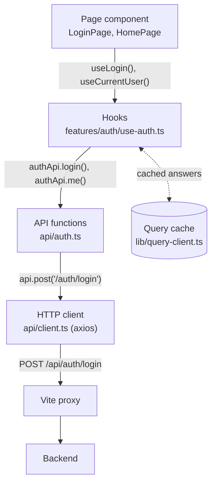
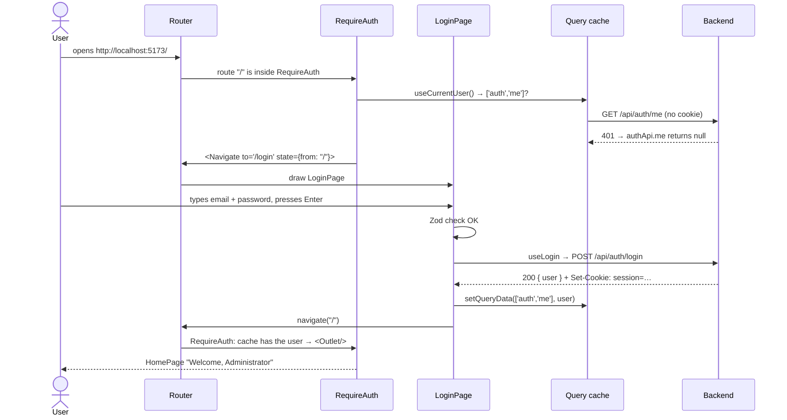

# Frontend data flow: axios, TanStack Query and React Router

Three libraries connect our screens to the backend and to each other.

| Library | Question it answers | Our files |
|---|---|---|
| **axios** | *How do I send a request?* | `src/api/` |
| **TanStack Query** | *How do I load, cache and update server data in components?* | `src/lib/query-client.ts`, `features/*/use-*.ts` |
| **React Router** | *Which page do I show for this URL?* | `src/router.tsx` |

## 1. The layers



Each layer has one job, so each file stays small:
- **Pages** show things and react to clicks. They never build URLs.
- **Hooks** decide *when* to load and what to do after a change (update the cache, navigate).
- **API functions** know the URLs and the shapes of requests and answers.
- **The client** knows how to talk HTTP (base URL, timeout).

When the backend changes a URL, only `api/*.ts` changes.

## 2. axios: sending requests

`fetch` (used in patch 04) is built into the browser. **axios** is a small library on top
of the same idea, with conveniences:

```ts
const { data } = await api.post('/auth/login', { email, password });
```
- It turns the object into JSON and sets `Content-Type: application/json`.
- It parses the JSON answer into `data`.
- It **throws for 4xx and 5xx answers** (`fetch` doesn't), so `try/catch` sees every failure.
- One configured instance (`api`) holds the settings for all calls: `baseURL: '/api'`, timeout.

## 3. TanStack Query: server data in components

Data that lives on the server (the logged-in user, projects, users…) has problems that
normal React state doesn't solve: loading and error states, the same data needed by many
components, data going stale, refreshing after a change. **TanStack Query** handles all of it.

### Queries: reading

```ts
const { data, isPending, isError, refetch } = useQuery({
  queryKey: ['auth', 'me'],   // the name of this data in the cache
  queryFn: authApi.me,        // how to load it
});
```

| You get | Meaning |
|---|---|
| `data` | The answer (`undefined` until it arrives) |
| `isPending` | `true` until the first answer arrives |
| `isError` / `error` | The request failed (after retrying once) |
| `refetch()` | Load it again now |

**The query key is the heart of it.** Every component that asks for `['auth', 'me']`
shares **one cached answer**. `RequireAuth`, `LoginPage` and `HomePage` all call
`useCurrentUser()`, but the request is sent once. When the cache entry changes, every
component using it re-renders.

An answer counts as **fresh** for 30 seconds (our `staleTime`), so components that appear
during that time reuse it without a new request. After that it's *stale*: still shown,
but refreshed in the background at the next good moment, e.g. when you come back to the
browser tab. That's how the app notices a login that expired while you were away.

### Mutations: changing

```ts
const login = useMutation({
  mutationFn: ({ email, password }) => authApi.login(email, password),
  onSuccess: (user) => queryClient.setQueryData(['auth', 'me'], user),
});

await login.mutateAsync({ email, password });   // run it and wait
login.mutate();                                 // run it, don't wait
login.isPending                                 // true while it runs
```

A mutation is an action that **changes** something on the server. It doesn't run by
itself: you call `mutate()` / `mutateAsync()`. Afterwards you tell the cache what changed:
- `setQueryData(key, value)`: "I already know the new value, store it" (login → the user).
- `invalidateQueries({ queryKey })`: "this data is out of date, reload it"
  (after creating a user, the users list: coming in the next screen).
- `clear()`: "forget everything" (logout).

## 4. React Router: pages and URLs

In a single-page app there's only one HTML page, so *React* decides what to draw for each
URL. **React Router** maps URLs to components:

```tsx
createBrowserRouter([
  { path: '/login', element: <LoginPage /> },
  {
    element: <RequireAuth />,              // a "layout route" with no path of its own
    children: [{ path: '/', element: <HomePage /> }],
  },
  { path: '*', element: <Navigate to="/" replace /> },
]);
```

| Piece | Meaning |
|---|---|
| `path` + `element` | For this URL, draw this component |
| `children` | Routes nested inside a parent. The parent draws `<Outlet />` where the child page goes. |
| `path: '*'` | Any URL not matched above |
| `<Navigate to="/login" />` | A component that redirects as soon as it's drawn |
| `useNavigate()` | A function to change page from code: `navigate('/')` |
| `useLocation()` | The current URL, and the optional `state` passed by the previous page |
| `replace` | Replace the current history entry instead of adding one (the Back button won't return to the redirect) |

Changing page this way doesn't reload anything: React just draws different components.

### Guards

A **guard** is a layout route that decides whether its children may be shown.
`RequireAuth` draws a spinner while it asks `/api/auth/me`, redirects to `/login` if
nobody is logged in, and otherwise draws `<Outlet />`: the requested page. Every page we
add inside its `children` is protected automatically.

> Remember: a guard only hides pages. **Security is the backend's job.** Even without the
> guard, the API refuses data to someone who isn't logged in.

## 5. The whole login, end to end



## 6. Why the logged-in user isn't in a Zustand store

The plan mentioned **Zustand** (a small global-state library) for the logged-in user.
But the user is **server data**: the server decides who is logged in (through the cookie),
and we only keep a copy. TanStack Query is made for exactly that, so a second store would
just duplicate it. Zustand will appear for real *browser-only* state, like the editor's
selected drawing tool or the upload queue.
