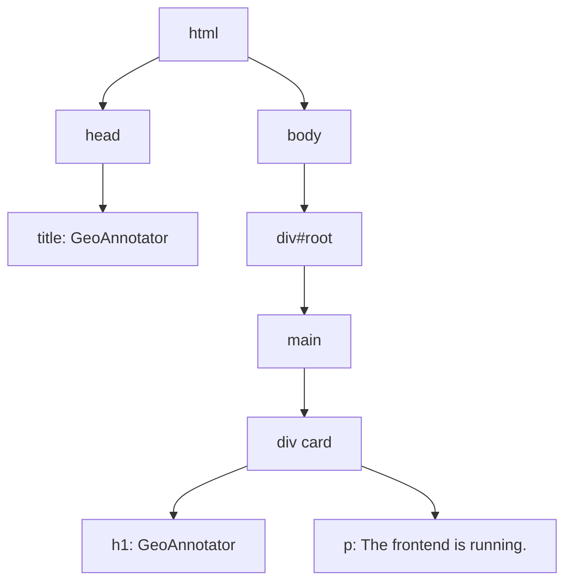
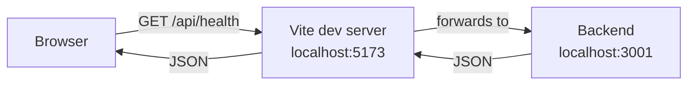

# How a web page works: HTML, CSS, JavaScript and the DOM

## 1. Three languages, three jobs

| Language | Job | Example |
|---|---|---|
| **HTML** | *What* is on the page: structure and content | a heading, a form, a button |
| **CSS** | *How* it looks: colours, sizes, spacing, layout | the button is blue with rounded corners |
| **JavaScript** | *What happens*: behaviour | clicking the button sends the login request |

### HTML

HTML is text made of **elements**, written with **tags**:

```html
<form>
  <label for="email">Email</label>
  <input id="email" type="email" placeholder="name@organization.com" />
  <button type="submit">Sign In</button>
</form>
```

- `<form>…</form>`: an opening and a closing tag around content.
- `<input … />`: an element with no content, closed immediately.
- `id="email"`, `type="email"`: **attributes**, extra information about the element.
- Elements nest inside each other and form a tree.

Common elements: `<div>` (a generic box), `<p>` (paragraph), `<h1>`–`<h6>` (headings),
`<a>` (link), ``, `<button>`, `<input>`, `<label>`, `<form>`, `<main>`, `<nav>`.

### CSS

CSS says how elements look:

```css
button {
  background-color: #1b6ef3;
  color: white;
  padding: 8px 16px;
  border-radius: 6px;
}
```

We rarely write CSS like this ourselves. We use **Tailwind** instead, where each class is one
small piece of CSS ([Tailwind](tailwind.md)):
`<button class="bg-primary text-white px-4 py-2 rounded">`.

### JavaScript

JavaScript runs in the browser and can read and change the page:

```js
document.querySelector('button').addEventListener('click', () => {
  alert('Clicked!');
});
```

## 2. The DOM: the page as a living tree

When the browser loads HTML, it builds a tree of objects in memory: the **DOM**
(Document Object Model). What you see on screen is drawn from the DOM, not from the HTML
file. JavaScript changes the DOM, and the screen updates.



Changing the DOM by hand becomes very hard as a page grows: which elements must change
when the user logs in? When a list gets a new item? **React** solves that: you describe
what the page *should* look like for the current data, and React updates the DOM for you
([React basics](react-basics.md)).

## 3. A "single-page application"

Our `index.html` is almost empty: one `<div id="root">` and one `<script>`. The script
(our React app) builds the entire page inside that div. When you "change page" (from
login to home), no new HTML is downloaded: React just draws something else. This kind of
app is a **single-page application (SPA)**. It feels fast, because only data travels
between browser and server (`/api/…` JSON), not whole pages.

## 4. The browser's developer tools (use them constantly)

Press **F12** (or right-click → *Inspect*) in Chrome, Edge or Firefox:

| Tab | What you learn there |
|---|---|
| **Elements** | The live DOM. Hover an element to highlight it; see and even edit its CSS classes. |
| **Console** | Errors from our JavaScript, and anything we `console.log`. |
| **Network** | **Every request the page makes**: `GET /api/health`, `POST /api/auth/login`… Click one to see its headers, the body sent, and the response. It's Postman, but for what the app really does. |
| **Application** | Cookies (from patch 06 you'll see `session` here, marked HttpOnly), local storage. |

Tip: in the Network tab, click **Fetch/XHR** to only see our API calls.

## 5. The dev server and the build

Browsers understand HTML, CSS and JavaScript, but not TypeScript, JSX or Tailwind classes.
**Vite** translates our code into what the browser understands:

- **In development** (`npm run dev`): Vite serves the app at http://localhost:5173 and
  translates each file the moment the browser asks for it. When you save a file, the page
  updates **without reloading** (*Hot Module Replacement*), and it keeps what you typed.
- **For production** (`npm run build`): Vite bundles everything into a few optimized files
  in `dist/`, which any web server can serve.

## 6. How the page reaches the API

The browser loads the page from `localhost:5173` (Vite) but our API is on `localhost:3001`.
Browsers treat different ports as different **origins** and restrict requests between them
(*CORS* rules). Instead of fighting those rules, Vite's dev server **forwards** (*proxies*)
every `/api/…` request to the backend:



To the browser, everything comes from one address, so cookies and requests just work. In
production, a web server (nginx) does the same job.
