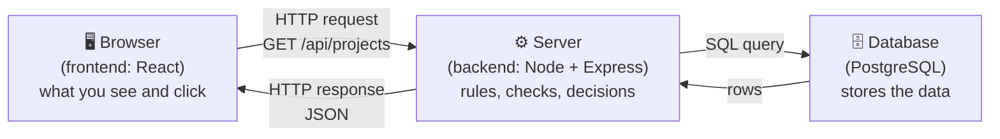

# How the web works

This is the mental model behind everything we build. Read it slowly once; come back to it
whenever a word in a patch guide is unclear.

## 1. The three parts of our app



- The **frontend** runs *inside the user's browser*. It draws the screens and reacts to clicks.
  It never talks to the database directly.
- The **backend** runs on a server (on your computer during development). It receives
  requests, checks who is asking and whether they are allowed, reads or writes the
  database, and answers.
- The **database** keeps the data safe when everything else is switched off.

Why not let the browser talk to the database? Because anyone can open the browser's
developer tools and change the code running there. The backend is the only place we
control, so **every rule is enforced in the backend**. The frontend only hides buttons
to be friendly; the backend is the real guard.

## 2. A URL, piece by piece

```
http://localhost:3001/api/projects/42?sort=name
└┬─┘   └───┬───┘ └┬─┘ └──────┬──────┘└───┬───┘
scheme   host    port      path       query string
```

- **host**: which computer. `localhost` means *this* computer.
- **port**: which program on that computer. One computer runs many servers, each on its
  own port. Our backend uses **3001**, the frontend dev server **5173**, PostgreSQL **5432**.
- **path**: which thing on the server. Our API paths all start with `/api`.
- **query string**: optional extra options after `?`, like `?sort=name`.

## 3. HTTP: the language of requests and responses

The browser (or Postman) sends a **request**; the server sends back a **response**.

```
REQUEST                                  RESPONSE
POST /api/auth/login HTTP/1.1            HTTP/1.1 200 OK
Host: localhost:3001                     Content-Type: application/json
Content-Type: application/json           Set-Cookie: session=eyJ...; HttpOnly

{"email":"a@b.com","password":"…"}       {"user":{"id":"…","name":"Admin"}}
└── method, path, headers, body          └── status, headers, body
```

### Methods: *what* you want to do

| Method | Meaning | Example in our app |
|---|---|---|
| `GET` | Read something. Never changes data. | List projects |
| `POST` | Create something, or perform an action | Create a user, log in |
| `PATCH` | Change some fields of something | Rename a project |
| `PUT` | Replace something completely | (we rarely use it) |
| `DELETE` | Remove something | Delete a task |

### Status codes: *how it went*

| Code | Name | When our API uses it |
|---|---|---|
| `200` | OK | Worked, here is the data |
| `201` | Created | A new thing was created |
| `204` | No Content | Worked, nothing to send back |
| `400` | Bad Request | The data you sent is invalid (e.g. missing email) |
| `401` | Unauthorized | You are not logged in, or your login is wrong |
| `403` | Forbidden | You are logged in but not allowed to do this |
| `404` | Not Found | That thing (or URL) does not exist |
| `409` | Conflict | Not possible in the current state (e.g. email already used) |
| `429` | Too Many Requests | Slow down (e.g. too many login attempts) |
| `500` | Internal Server Error | A bug on the server |

Easy rule: **2xx = success, 4xx = the caller did something wrong, 5xx = the server did.**

### Headers: *information about the message*

Key–value lines such as `Content-Type: application/json` (the body is JSON) or
`Cookie: session=…` (who I am). You rarely write them by hand; the libraries do it.

### Body: *the data itself*

For our API it is always **JSON**.

## 4. JSON

JSON (JavaScript Object Notation) is text that describes data. Both the browser and the
server can read and write it.

```json
{
  "id": "7c1e…",
  "name": "Riverside survey",
  "imageCount": 12,
  "isArchived": false,
  "tags": ["urban", "2026"],
  "owner": { "id": "a91f…", "name": "Admin" }
}
```

Objects `{ }` hold named values, arrays `[ ]` hold lists; values are strings, numbers,
`true`/`false`, `null`, or more objects and arrays.

## 5. What an "API" and "REST" mean

An **API** (Application Programming Interface) is the list of requests a server
understands, and what each one returns. Our backend *is* an API: it returns data
(JSON), not web pages.

**REST** is a common style for designing those URLs: the path names a *thing* (a resource)
and the method says *what to do* with it.

```
GET    /api/projects        → list projects
POST   /api/projects        → create a project
GET    /api/projects/42     → read project 42
PATCH  /api/projects/42     → change project 42
DELETE /api/projects/42     → delete project 42
```

## 6. Development vs production

- **Development** (now): everything runs on your computer, on `localhost`, with tools that
  reload the code as soon as you save a file.
- **Production** (the final patches): the app runs on a real server, built and optimized,
  and people reach it through a normal web address.
