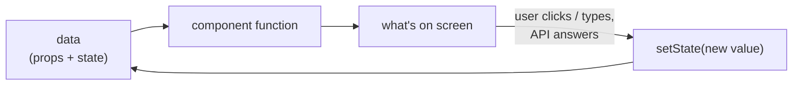

# React basics: components, JSX, props, state and effects

**React** is a library for building user interfaces from **components**. You describe what
the screen should look like *for the current data*; when the data changes, React updates
the page for you.

## 1. Components

A component is a **function that returns what to show**. Its name starts with a capital letter.

```tsx
function Greeting() {
  return <h1>Hello!</h1>;
}
```

Components are used like HTML tags, and can contain other components:

```tsx
function App() {
  return (
    <main>
      <Greeting />
      <Greeting />
    </main>
  );
}
```

A whole app is a **tree of components**. Our login screen will be:

```
App
└── LoginPage
    ├── Logo
    ├── Label + Input   (email)
    ├── Label + Input   (password)
    └── Button          (Sign In)
```

Each piece is small, readable, and reusable: the same `Button` is used on every screen.

## 2. JSX: HTML-like syntax inside TypeScript

The `<h1>Hello!</h1>` inside a function is **JSX**. It looks like HTML, but it's code
(files that contain it end in `.tsx`). The differences you'll meet:

| HTML | JSX | Why |
|---|---|---|
| `class="card"` | `className="card"` | `class` is a reserved word in JavaScript |
| `for="email"` | `htmlFor="email"` | same reason |
| `<input>` | `<input />` | every element must be closed |
| `onclick="…"` | `onClick={handleClick}` | events are camelCase and take a function |

**Curly braces `{ }` switch back to JavaScript** inside JSX:

```tsx
const name = 'Sara';
return <p>Hello {name}, you have {3 + 2} tasks</p>;   // → Hello Sara, you have 5 tasks
```

A component returns **one** root element. To group without an extra `<div>`, use a
*fragment*: `<>…</>`.

## 3. Props: passing data into a component

**Props** (properties) are the component's inputs, written like HTML attributes:

```tsx
type BadgeProps = { label: string; color: string };

function Badge({ label, color }: BadgeProps) {
  return <span className={color}>{label}</span>;
}

<Badge label="Passed" color="text-success" />
<Badge label="Failed" color="text-danger" />
```

A component must **never change its props**: they belong to the parent. Same props →
same result.

`children` is a special prop: whatever you put *between* the tags.

```tsx
function Card({ children }: { children: React.ReactNode }) {
  return <div className="bg-white rounded-lg p-4">{children}</div>;
}

<Card><p>Anything can go here</p></Card>
```

## 4. State: data that changes

**State** is data a component remembers and can change, like the text typed into an input
or the answer from the API. You create it with the `useState` **hook**:

```tsx
import { useState } from 'react';

function Counter() {
  const [count, setCount] = useState(0);   // value, and the function that changes it

  return <button onClick={() => setCount(count + 1)}>Clicked {count} times</button>;
}
```

The key idea: **calling `setCount` makes React run the component function again** (a
*re-render*) with the new value, and update only the parts of the page that changed. You
never touch the DOM yourself.

- Never change state directly (`count = 5` does nothing on screen). Always use the setter.
- Each `<Counter />` on the page has its own separate `count`.

## 5. Rendering conditionally and in lists

```tsx
// Show different things depending on state
if (loading) return <p>Loading…</p>;
return <p>{error ? 'Something failed' : 'All good'}</p>;

// Show something only when a condition is true
{isAdmin && <AdminMenu />}

// One element per item in a list; `key` helps React keep track of which is which
<ul>
  {users.map((user) => <li key={user.id}>{user.name}</li>)}
</ul>
```

## 6. Effects: doing something after the component appears

A component function must only *compute what to show*. Anything else (fetching data,
timers, talking to non-React code) is a **side effect**, and goes in `useEffect`:

```tsx
useEffect(() => {
  fetch('/api/health').then(…);   // runs AFTER React has put the component on screen
}, []);                             // [] = only once, when the component first appears
```

The array at the end lists the values the effect depends on. `[]` = run once;
`[userId]` = run again whenever `userId` changes.

> In patch 06 we replace hand-written `useEffect` + `fetch` with **TanStack Query**, a
> library that handles loading, errors, caching and refreshing for us. But it's important
> to see the manual way first, so you know what the library does.

## 7. Hooks: the rules

Functions starting with `use` (`useState`, `useEffect`, later `useQuery`, `useForm`…) are
**hooks**. Two rules:
1. Call them only at the **top level** of a component: not inside `if`, loops or nested
   functions.
2. Call them only from **components** (or from other hooks).

## 8. StrictMode

`<StrictMode>` (in `main.tsx`) makes React run some things **twice in development only**,
to reveal bugs early. That's why you'll see two `GET /api/health` lines in the backend
log when the page loads. In production it runs once.

## 9. The mental model



**UI = f(data).** You only ever change the data; React keeps the screen in sync.
