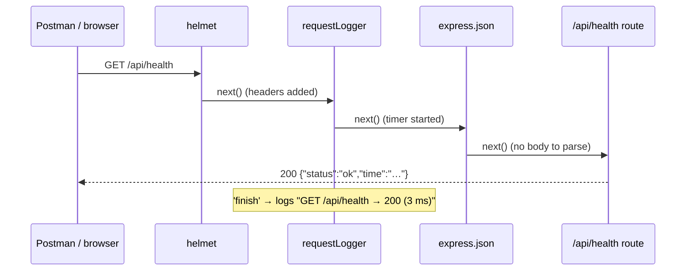

# `backend/src/app.ts`

> Added in **patch 01** · [View the code](../../../../backend/src/app.ts) · Background: [How the web works](../../../concepts/how-the-web-works.md)

## What it is for

**Builds** the Express application: which middleware runs, and which URL goes to which
code. This file grows in every backend patch, because every new feature registers its
routes here.

It does **not** start the server. That is [`server.ts`](server.ts.md)'s job. Keeping them
apart means tests (later) can create the app and send it fake requests without opening a
real port.

## The code, piece by piece

```ts
export function createApp() {
  const app = express();
```
`express()` creates an empty application. By itself, it answers nothing.

### 1. Middleware (runs for every request, top to bottom)

```ts
  app.use(helmet());
  app.use(requestLogger);
  app.use(express.json());
```

| Middleware | What it does |
|---|---|
| `helmet()` | Adds about a dozen **security headers** to every response. For example `X-Content-Type-Options: nosniff` stops browsers guessing file types, and `X-Frame-Options` stops other sites from embedding ours in a frame. You can see them in Postman's *Headers* tab. |
| `requestLogger` | Our own middleware: one log line per request ([explained here](middleware/request-logger.ts.md)). |
| `express.json()` | When a request has a JSON body (`Content-Type: application/json`), it turns the text into a JavaScript object at `req.body`. Without it, `req.body` would be `undefined`. We need it from patch 03 (login sends email + password as JSON). |

**Order matters.** A middleware only sees requests that the ones above it passed on.

### 2. Routes

```ts
  app.get('/api/health', (_req, res) => {
    res.json({ status: 'ok', time: new Date().toISOString() });
  });
```

Read it as: *when a `GET` request for the path `/api/health` arrives, run this function.*

- `app.get` → only for the `GET` method. There is also `app.post`, `app.patch`, `app.delete`.
- The function is the **route handler**. `_req` starts with `_` to say "I don't use this parameter".
- `res.json(object)` converts the object to JSON text, sets
  `Content-Type: application/json`, sets status `200`, and sends it.

A *health check* lets people and tools ask "are you alive?". In patch 02 it will also
check the database.

### 3. The "not found" handler

```ts
  app.use((req, res) => {
    res.status(404).json({ error: `Route not found: ${req.method} ${req.originalUrl}` });
  });
```

`app.use` without a path matches **everything**. Because it is added *after* all routes,
a request only reaches it when no route answered. `res.status(404)` sets the status
before `.json(...)` sends the body.

Without this, Express would answer with an HTML page. An API should always answer
with JSON, so the frontend can read the error the same way every time.

## What happens when you call `GET /api/health`



## Try it

1. Add a route `app.get('/api/hello', (_req, res) => { res.json({ message: 'Hi!' }); });`
   above the 404 handler. Save; `tsx watch` restarts the server. Open
   http://localhost:3001/api/hello in your browser.
2. Move your route *below* the 404 handler and try again. Why does it return 404 now?
3. Undo your changes.
