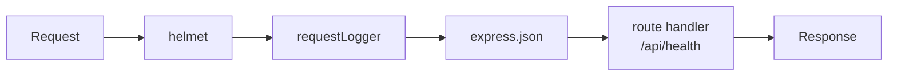

# `backend/src/middleware/request-logger.ts`

> Added in **patch 01** · [View the code](../../../../../backend/src/middleware/request-logger.ts)

## What it is for

Our **first middleware**. It prints one line for every request the server answers:

```
[04:23:48] INFO: GET /api/health → 200 (3 ms)
[04:23:48] INFO: GET /api/nope → 404 (0 ms)
```

Watching this line while you click around the app (or send Postman requests) is the
easiest way to see *which* API calls a screen makes.

## What is middleware?

Express handles a request by passing it through a **chain of functions**, in the order
they were added with `app.use(...)`. Each function is a *middleware*. It receives:

- `req`: the **request**: method, URL, headers, body…
- `res`: the **response** it can send back
- `next`: a function to call to **pass the request on** to the next middleware



A middleware either **answers** (`res.json(...)`) and the chain stops, or calls `next()`
and the request continues. If it does neither, the request hangs forever. That is the #1
middleware bug to remember.

## The code, piece by piece

```ts
export function requestLogger(req: Request, res: Response, next: NextFunction) {
```
The three parameters every middleware gets. `Request`, `Response` and `NextFunction` are
TypeScript types from Express, so the editor knows what `req` and `res` contain.

```ts
  const startedAt = Date.now();
```
`Date.now()` = the current time in milliseconds. We remember when the request arrived.

```ts
  res.on('finish', () => {
    const ms = Date.now() - startedAt;
    logger.info(`${req.method} ${req.originalUrl} → ${res.statusCode} (${ms} ms)`);
  });
```
We can't log the status code yet, because no one has answered. So we **register a
listener**: "when the response has *finished* being sent, run this function". By then
`res.statusCode` is known (200, 404, …) and we can compute how long it took.

`` `…${x}…` `` is a **template string**: the backticks let you insert values with `${ }`.

```ts
  next();
}
```
Hand the request to the next middleware. The `finish` listener runs later, on its own.

## Try it

Add a second log line *before* `next()`: `logger.info('request arrived')`. Send one request
and notice the order of the two lines. Then remove it again.
