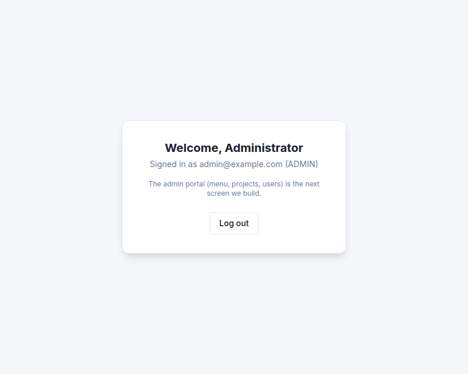

# `frontend/src/features/home/HomePage.tsx`

> Added in **patch 06** · [View the code](../../../../../../frontend/src/features/home/HomePage.tsx)

## What it is for

A **placeholder** start page that proves the login works: it greets the logged-in user
and has a working **Log out** button. The next screen replaces it with the real admin
portal (sidebar, top bar, dashboard).



## The code

```tsx
  const { data: user } = useCurrentUser();
  const logout = useLogout();
```
- The user comes from the cache. It's already there, because `RequireAuth` (or the login)
  loaded it, so no new request is made.
- `logout` is the mutation from [`use-auth.ts`](../auth/use-auth.ts.md).

```tsx
        <h1 className="text-xl font-bold text-text-primary">Welcome, {user?.name}</h1>
        <p className="mt-1 text-sm text-text-secondary">
          Signed in as {user?.email} ({user?.role})
        </p>
```
`user?.name`: TypeScript thinks `user` could still be `undefined` or `null` (the hook
can't know that `RequireAuth` already checked). `?.` shows nothing in that case instead of
crashing.

```tsx
        <Button variant="secondary" className="mt-6" onClick={() => logout.mutate()} disabled={logout.isPending}>
          {logout.isPending ? 'Logging out…' : 'Log out'}
        </Button>
```
- `onClick={() => logout.mutate()}`: on click, call the logout endpoint. We pass a small
  arrow function, because `onClick={logout.mutate}` would hand it the click event as an
  argument.
- While the request runs, the button is disabled and says *Logging out…*.
- After it, `useLogout` clears the cache and goes to `/login`.
