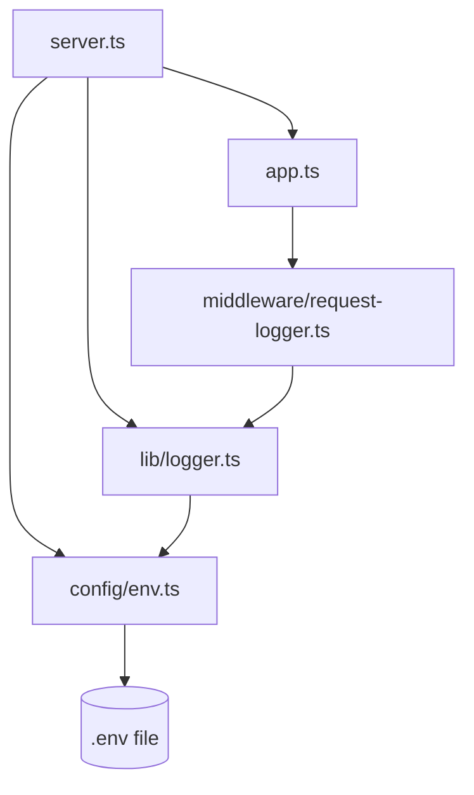

# Patch 01: Backend, the first server

| | |
|---|---|
| **Screen** | Login (Admin portal): step 1 of 6 |
| **Part** | Backend |
| **Commit** | `Patch 01: backend first server` → `git show --stat ':/^Patch 01:'` |
| **Before you start** | Install the tools in [setup.md](../setup.md) |

## Where we are

The login screen needs three things: a **server** that can answer requests, a **database**
that knows the users, and a **page** to type into. This patch builds the smallest possible
server: it answers one question, *"are you alive?"*.

```
Login screen
 ├── ✅ 01 Backend: first server            ← this patch
 ├── ⬜ 02 Database and first admin user
 ├── ⬜ 03 Login API + Postman
 ├── ⬜ 04 Frontend: first page
 ├── ⬜ 05 Login screen design
 └── ⬜ 06 Connect the screen to the API
```

## New concepts (read first)

1. [How the web works](../concepts/how-the-web-works.md): browser, server, database;
   URLs, HTTP methods, status codes, JSON, REST.
2. [Node.js, npm and TypeScript](../concepts/node-npm-typescript.md): packages,
   `package.json`, types, `import`/`export`, `async`/`await`.

## Files in this patch (read in this order)

| # | File | What it does | Explanation |
|---|---|---|---|
| 1 | `backend/package.json` | Packages and commands | [read](../files/backend/package.json.md) |
| 2 | `backend/tsconfig.json` | TypeScript settings | [read](../files/backend/tsconfig.json.md) |
| 3 | `backend/.env.example` | Template for your settings | [read](../files/backend/.env.example.md) |
| 4 | `backend/src/config/env.ts` | Reads and checks the settings | [read](../files/backend/src/config/env.ts.md) |
| 5 | `backend/src/lib/logger.ts` | Prints readable log lines | [read](../files/backend/src/lib/logger.ts.md) |
| 6 | `backend/src/middleware/request-logger.ts` | Logs every request (our first middleware) | [read](../files/backend/src/middleware/request-logger.ts.md) |
| 7 | `backend/src/app.ts` | Builds the app: middleware + routes | [read](../files/backend/src/app.ts.md) |
| 8 | `backend/src/server.ts` | Starts listening on port 3001 | [read](../files/backend/src/server.ts.md) |
| – | `.gitignore` | Files git must never save | [read](../files/.gitignore.md) |
| – | `postman/*.json` | Requests to test the API | [how to use](../postman.md) |

How the files depend on each other:



## Run it

```bash
cd backend
cp .env.example .env     # your own settings file (Windows cmd: copy .env.example .env)
npm install              # downloads the packages into node_modules/
npm run dev              # starts the server
```

You should see:

```
[10:15:02] INFO: API ready on http://localhost:3001
```

Leave this terminal open: the server runs until you press `Ctrl+C`. Edit any file and save;
`tsx watch` restarts it automatically.

## Test it

**In the browser:** open http://localhost:3001/api/health →

```json
{ "status": "ok", "time": "2026-09-29T10:15:10.123Z" }
```

Look at the terminal: a new line `GET /api/health → 200 (2 ms)` appeared.

**In Postman:** import the two files from `postman/` ([how](../postman.md)), pick the
*GeoAnnotator – Local* environment, open folder **Patch 01 · Health**:

| Request | Expected |
|---|---|
| Health check | `200` and `{ "status": "ok", … }` |
| Unknown route → 404 | `404` and `{ "error": "Route not found: GET /api/does-not-exist" }` |

Open the **Headers** tab of the response: the security headers added by `helmet` are there.

**Type check:** `npm run typecheck` prints nothing when there are no errors.

**Broken settings:** stop the server and run `PORT=abc npm run dev`
(PowerShell: `$env:PORT="abc"; npm run dev`, then `Remove-Item Env:PORT` afterwards).
The server refuses to start and tells you why.

## Check yourself

1. Which file does Node run first, and which command starts it?
2. What would happen if `express.json()` were removed? (Hint: nothing yet. When will it matter?)
3. Why does the 404 handler have to be the *last* `app.use`?
4. What does a middleware have to do so the request doesn't hang?
5. Why is `.env` in `.gitignore` but `.env.example` isn't?

<details>
<summary>Answers</summary>

1. `src/server.ts`, started by `npm run dev` (which runs `tsx watch src/server.ts`).
2. Nothing changes yet, because no route reads a request body. From patch 03, the login
   route needs `req.body.email`, which would be `undefined` without it.
3. Express tries handlers in order. The 404 handler matches every request, so any route
   added after it would never be reached.
4. Either send a response (`res.json(...)`) or call `next()`.
5. `.env` will hold real secrets (passwords, keys). `.env.example` only holds safe example
   values that show which settings exist.

</details>

## Next

**Patch 02: Database and first admin user.** We start PostgreSQL, describe the `users`
table with Prisma, and create the admin account you will log in with.
