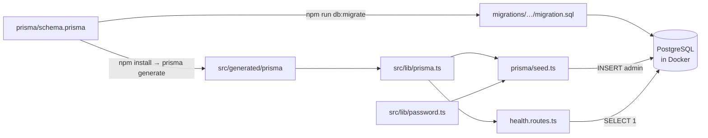

# Patch 02: Database and the first admin user

| | |
|---|---|
| **Screen** | Login (Admin portal): step 2 of 6 |
| **Part** | Backend + database |
| **Commit** | `Patch 02: database and first admin` → `git show --stat ':/^Patch 02:'` |
| **Before you start** | Docker Desktop installed and running ([setup.md](../setup.md)) |

## Where we are

To log in, the server must be able to look up a user by email and check their password.
So we need a **database**, a **users table**, and **one user** in it: the admin.

```
Login screen
 ├── ✅ 01 Backend: first server
 ├── ✅ 02 Database and first admin user    ← this patch
 ├── ⬜ 03 Login API + Postman
 ├── ⬜ 04 Frontend: first page
 ├── ⬜ 05 Login screen design
 └── ⬜ 06 Connect the screen to the API
```

## New concepts (read first)

[Databases, SQL, Prisma and Docker](../concepts/databases.md): tables, rows, primary keys,
SQL and CRUD, what an ORM is, schema → migration → client, containers and volumes.

## Files in this patch (read in this order)

| # | File | New / changed | What it does | Explanation |
|---|---|---|---|---|
| 1 | `docker-compose.yml` | new | Runs PostgreSQL in a container | [read](../files/docker-compose.yml.md) |
| 2 | `backend/.env.example` | changed | Adds `DATABASE_URL` and the `ADMIN_*` settings | [read](../files/backend/.env.example.md) |
| 3 | `backend/prisma/schema.prisma` | new | Describes the `users` table and the `Role` enum | [read](../files/backend/prisma/schema.prisma.md) |
| 4 | `backend/prisma/migrations/…_create_users/migration.sql` | new (generated) | The SQL that creates the table | [read](../files/backend/prisma/migrations/20260929043050_create_users/migration.sql.md) |
| 5 | `backend/prisma.config.ts` | new | Settings for the Prisma command-line tool | [read](../files/backend/prisma.config.ts.md) |
| 6 | `backend/src/config/env.ts` | changed | Also checks `DATABASE_URL` | [read](../files/backend/src/config/env.ts.md) |
| 7 | `backend/src/lib/prisma.ts` | new | The shared database client | [read](../files/backend/src/lib/prisma.ts.md) |
| 8 | `backend/src/lib/password.ts` | new | Hash and check passwords with bcrypt | [read](../files/backend/src/lib/password.ts.md) |
| 9 | `backend/prisma/seed.ts` | new | Creates the first admin | [read](../files/backend/prisma/seed.ts.md) |
| 10 | `backend/src/modules/health/health.routes.ts` | new | Health check, now also asks the database | [read](../files/backend/src/modules/health/health.routes.ts.md) |
| 11 | `backend/src/app.ts` | changed | Mounts the health router | [read](../files/backend/src/app.ts.md) |
| 12 | `backend/package.json` | changed | New packages and `db:*` scripts | [read](../files/backend/package.json.md) |
| – | `backend/tsconfig.json` | changed | Also checks `prisma/` | [read](../files/backend/tsconfig.json.md) |



## Run it

From the project root (the folder with `docker-compose.yml`):

```bash
docker compose up -d          # 1. start PostgreSQL (the first time downloads the image)
docker compose ps             #    wait until STATUS shows "healthy"
```

Then in `backend/`:

```bash
cd backend
cp .env.example .env          # 2. refresh your settings (new lines were added)
npm install                   # 3. new packages; also generates the Prisma client
npm run db:migrate            # 4. creates the users table
npm run db:seed               # 5. creates the admin: "Created admin admin@example.com"
npm run dev                   # 6. start the API
```

> **No Docker?** Install PostgreSQL 16 from https://www.postgresql.org/download/, then in
> its `psql` shell run:
> `CREATE ROLE geo WITH LOGIN CREATEDB PASSWORD 'geo_dev_password';` and
> `CREATE DATABASE geoannotator OWNER geo;`. Everything else stays the same.

## Test it

**Health now checks the database:** http://localhost:3001/api/health →

```json
{ "status": "ok", "database": "ok", "time": "…" }
```

Stop the database (`docker compose stop db`), refresh: `503` and
`"database": "unreachable"`. Start it again (`docker compose start db`), refresh: `200`.

**Postman:** re-import the collection (choose *Replace*). *Patch 01 · Health → Health check*
now also tests `database: "ok"`.

**Look at your data:** `npm run db:studio` opens http://localhost:5555. Click `User`:
one row, your admin. Look at `passwordHash`: it starts with `$2b$12$`, and the real
password is nowhere in the database.

**Or with SQL**, straight inside the container:

```bash
docker compose exec db psql -U geo -d geoannotator -c "SELECT id, name, email, role FROM users;"
```

## Check yourself

1. What are the three things Prisma produces or uses, and which one do you edit by hand?
2. Why is `src/generated/` in `.gitignore`, but `prisma/migrations/` is committed?
3. Why does the seed check whether the admin exists before creating it?
4. Two users choose the password `123456`. Are their `passwordHash` values equal? Why?
5. The health check returns `503` instead of `500` when the database is down. What's the difference?

<details>
<summary>Answers</summary>

1. The **schema** (you edit it), **migrations** (generated SQL, committed, never edited
   after they ran), and the **client** (generated TypeScript code).
2. The client can be regenerated from the schema at any time (`npm install` does it).
   Migrations are the *history* of the database: every computer must replay the same steps.
3. So it can be run any number of times without failing or creating duplicates
   (it is *idempotent*). The `@unique` email would also make a second insert fail.
4. No. bcrypt adds a random salt to each one, so the hashes differ even though
   `verifyPassword` accepts `123456` for both.
5. `500` means "the server has a bug". `503` means "the server is fine but can't do its job
   right now; try again later", which is exactly the situation.

</details>

## Next

**Patch 03: Login API.** `POST /api/auth/login` checks the email and password against this
table and gives the browser a login cookie. We'll test every case in Postman.
