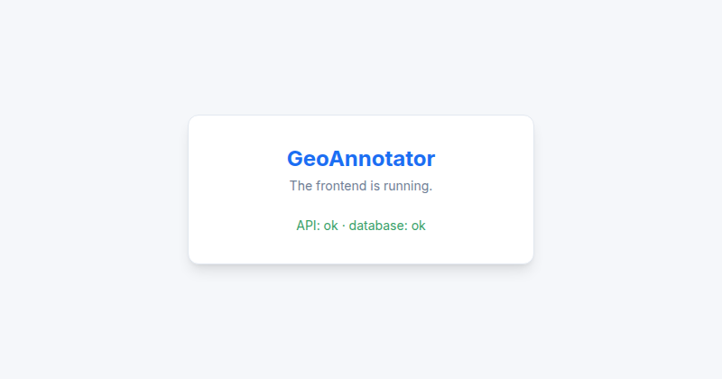
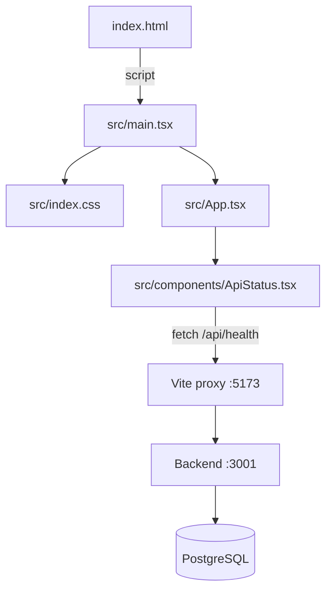

# Patch 04: Frontend, the first page

| | |
|---|---|
| **Screen** | Login (Admin portal): step 4 of 6 |
| **Part** | Frontend |
| **Commit** | `Patch 04: frontend first page` → `git show --stat ':/^Patch 04:'` |

## Where we are

The backend is ready. Now we create the **frontend**: the part that runs in the browser.
This patch builds the smallest React app that proves the whole chain works:
**browser → Vite → backend → database**, and back.

```
Login screen
 ├── ✅ 01 Backend: first server
 ├── ✅ 02 Database and first admin user
 ├── ✅ 03 Login API + Postman
 ├── ✅ 04 Frontend: first page             ← this patch
 ├── ⬜ 05 Login screen design
 └── ⬜ 06 Connect the screen to the API
```



## New concepts (read first, in this order)

1. [How a web page works](../concepts/how-a-web-page-works.md): HTML, CSS, JavaScript,
   the DOM, single-page apps, the browser's developer tools, Vite, the proxy.
2. [React basics](../concepts/react-basics.md): components, JSX, props, state, effects.
3. [Tailwind CSS](../concepts/tailwind.md): styling with small classes, our colour tokens.

## Files in this patch (read in this order)

This is the order the browser meets them:

| # | File | What it does | Explanation |
|---|---|---|---|
| 1 | `frontend/package.json` | Packages and commands | [read](../files/frontend/package.json.md) |
| 2 | `frontend/vite.config.ts` | Dev server, plugins, the `/api` proxy | [read](../files/frontend/vite.config.ts.md) |
| 3 | `frontend/index.html` | The one HTML page, with the empty `#root` | [read](../files/frontend/index.html.md) |
| 4 | `frontend/src/main.tsx` | Starts React inside `#root` | [read](../files/frontend/src/main.tsx.md) |
| 5 | `frontend/src/index.css` | Tailwind, the Inter font, our colours | [read](../files/frontend/src/index.css.md) |
| 6 | `frontend/src/App.tsx` | The root component: a centred card | [read](../files/frontend/src/App.tsx.md) |
| 7 | `frontend/src/components/ApiStatus.tsx` | Calls `/api/health` and shows the answer | [read](../files/frontend/src/components/ApiStatus.tsx.md) |
| – | `frontend/tsconfig.json` | TypeScript settings for the browser | [read](../files/frontend/tsconfig.json.md) |
| – | `frontend/public/favicon.svg` | The tab icon | [read](../files/frontend/public/favicon.svg.md) |



## Run it

You now run **two** servers, each in its own terminal:

```bash
# Terminal 1: backend (as before)
cd backend
npm run dev

# Terminal 2: frontend
cd frontend
npm install
npm run dev
```

Open **http://localhost:5173**. You should see the card with a green
**API: ok · database: ok**.

## Try it

1. **Live reload:** in `App.tsx`, change *The frontend is running.* to something else and
   save. The page updates instantly, without reloading.
2. **Change a colour everywhere:** in `index.css`, set `--color-primary` to `#e53e3e` and
   save: the title turns red. Change it back.
3. **Break the chain:** stop the backend (`Ctrl+C` in terminal 1) and reload the page. Red
   message. Start it again, reload: green. Then try with the database stopped
   (`docker compose stop db`).
4. **Developer tools (F12):**
   - *Elements*: find the `<div id="root">` and see what React put inside it.
   - *Network*: reload and click the `health` request: URL, status, response.
   - The backend terminal shows **two** health requests per page load. Read
     [React basics → StrictMode](../concepts/react-basics.md#8-strictmode) to see why.
5. **Type check:** `npm run typecheck` in `frontend/`. Then in `ApiStatus.tsx` rename
   `health.database` to `health.databse`: the editor underlines it, and the type check fails.
   Undo it.

## Check yourself

1. What's in `index.html`, and who builds the rest of the page?
2. Why does `fetch('/api/health')` work although the backend runs on port 3001?
3. What makes a React component show new content on screen?
4. What does the `[]` at the end of `useEffect(…, [])` mean?
5. Where would you change the app's main blue, and how many files would you edit?

<details>
<summary>Answers</summary>

1. Only an empty `<div id="root">` and the script tag that loads `main.tsx`. React builds
   everything else inside that div.
2. The page's own server (Vite, on 5173) forwards every `/api` request to the backend (the
   `proxy` in `vite.config.ts`). To the browser, it all comes from one address.
3. Changing its state with the setter (`setHealth(...)`). React then runs the component
   function again and updates what changed.
4. "Run this effect once, after the first render", because it depends on no values that
   could change.
5. In one place: `--color-primary` in `src/index.css`. Every `bg-primary`, `text-primary`…
   follows it.

</details>

## Next

**Patch 05: The login screen design.** We build the real login screen, matching the
original: reusable `Button`, `Input` and `Label` components, and a form that checks what
you type before sending anything.
