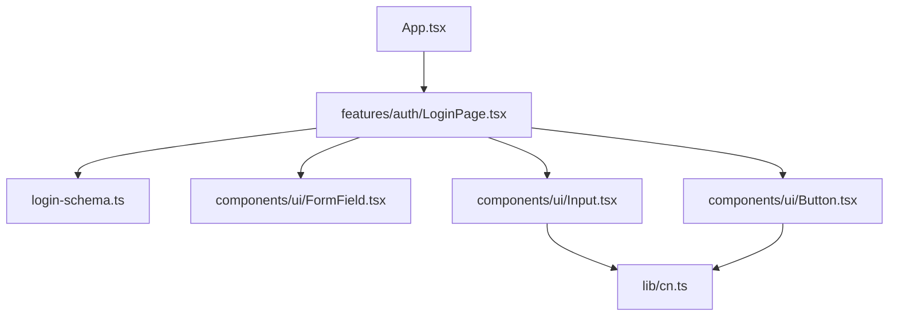

# Patch 05: The login screen design

| | |
|---|---|
| **Screen** | Login (Admin portal): step 5 of 6 |
| **Part** | Frontend |
| **Commit** | `Patch 05: login screen design` → `git show --stat ':/^Patch 05:'` |

## Where we are

We build the real login screen, matching the original. It already **checks what you type**
and shows a message under each wrong field, but doesn't send anything yet (that's patch 06).
Along the way we create the first **reusable UI components** (`Button`, `Input`,
`FormField`), which every later screen will use.

```
Login screen
 ├── ✅ 01 Backend: first server
 ├── ✅ 02 Database and first admin user
 ├── ✅ 03 Login API + Postman
 ├── ✅ 04 Frontend: first page
 ├── ✅ 05 Login screen design              ← this patch
 └── ⬜ 06 Connect the screen to the API
```

| Empty | After clicking *Sign In* with nothing typed |
|---|---|
|  |  |

## New concepts (read first)

[Forms in React](../concepts/forms.md): the browser's submit, React Hook Form, validating
in two places, accessibility attributes, reusable form pieces.

## Files in this patch (read in this order)

From the smallest building blocks up to the page:

| # | File | New / changed | What it does | Explanation |
|---|---|---|---|---|
| 1 | `frontend/src/lib/cn.ts` | new | Joins Tailwind classes cleanly | [read](../files/frontend/src/lib/cn.ts.md) |
| 2 | `frontend/src/components/ui/Button.tsx` | new | The app's button, with variants | [read](../files/frontend/src/components/ui/Button.tsx.md) |
| 3 | `frontend/src/components/ui/Input.tsx` | new | The app's text input, red when invalid | [read](../files/frontend/src/components/ui/Input.tsx.md) |
| 4 | `frontend/src/components/ui/FormField.tsx` | new | Label + input + error message | [read](../files/frontend/src/components/ui/FormField.tsx.md) |
| 5 | `frontend/src/features/auth/login-schema.ts` | new | The form's rules (Zod) | [read](../files/frontend/src/features/auth/login-schema.ts.md) |
| 6 | `frontend/src/features/auth/LoginPage.tsx` | new | The login screen | [read](../files/frontend/src/features/auth/LoginPage.tsx.md) |
| 7 | `frontend/src/App.tsx` | changed | Shows the login screen | [read](../files/frontend/src/App.tsx.md) |
| – | `frontend/src/components/ApiStatus.tsx` | **removed** | The patch 04 test is no longer needed | [read](../files/frontend/src/components/ApiStatus.tsx.md) |
| – | `frontend/package.json` | changed | Form and class-name packages | [read](../files/frontend/package.json.md) |



## The folder structure grows

```
frontend/src/
├── components/ui/     ← generic building blocks, used by every feature
├── features/auth/     ← everything about logging in
└── lib/               ← small helpers
```

`components/ui` knows nothing about logins or projects; `features/*` use those pieces to
build real screens.

## Run it

```bash
cd frontend
npm install      # new packages
npm run dev
```

Open http://localhost:5173. The backend isn't needed for this patch.

## Try it

1. Click **Sign In** with empty fields: two red messages, and the cursor jumps to *Email*.
2. Type `abc` in Email: the message changes to *Enter a valid email address* **as you
   type**. Complete it to `abc@x.com`: the message disappears.
3. Fill both fields and press **Enter**. Open the browser console (F12 → Console):
   *Form is valid. Patch 06 will send it…*
4. Click the word **Password** (the label): the cursor goes into the password field.
5. Press **Tab** to move through the form: see the blue focus ring on the button
   (`focus-visible`).
6. In `LoginPage.tsx`, give the button `variant="danger"`, save, look, undo.
7. Screen-reader view: F12 → Elements → select the email input → *Accessibility* pane. After
   a failed submit it shows *invalid: true* and the error as its description.

## Check yourself

1. What does `handleSubmit(onSubmit)` do before calling `onSubmit`?
2. Why check the email in the browser if the server checks it anyway?
3. What does `{...register('email')}` put on the input?
4. Why does `Button` accept `ComponentProps<'button'>` instead of listing its own props?
5. Where does the red border of an invalid input come from?

<details>
<summary>Answers</summary>

1. It prevents the browser's page reload, validates all fields with the Zod schema, shows
   the errors and focuses the first invalid field; only if everything is valid does it
   call `onSubmit(values)`.
2. For the user: instant messages without a round trip to the server. The server check
   is still the one that protects the data.
3. The props React Hook Form needs to follow the field: `name`, `onChange`, `onBlur` and
   `ref`.
4. So it works everywhere a normal button does (`type`, `onClick`, `disabled`, `aria-*`…)
   without us re-declaring each prop.
5. From the `aria-invalid` attribute: `Input` has the classes `aria-invalid:border-danger`,
   and the page sets `aria-invalid` when the field has an error.

</details>

## Next

**Patch 06: Connect the screen to the API.** *Sign In* sends the form to
`POST /api/auth/login`, shows the server's error if the login is wrong, and on success
opens a first (placeholder) page for the logged-in admin, with a working Logout button.
