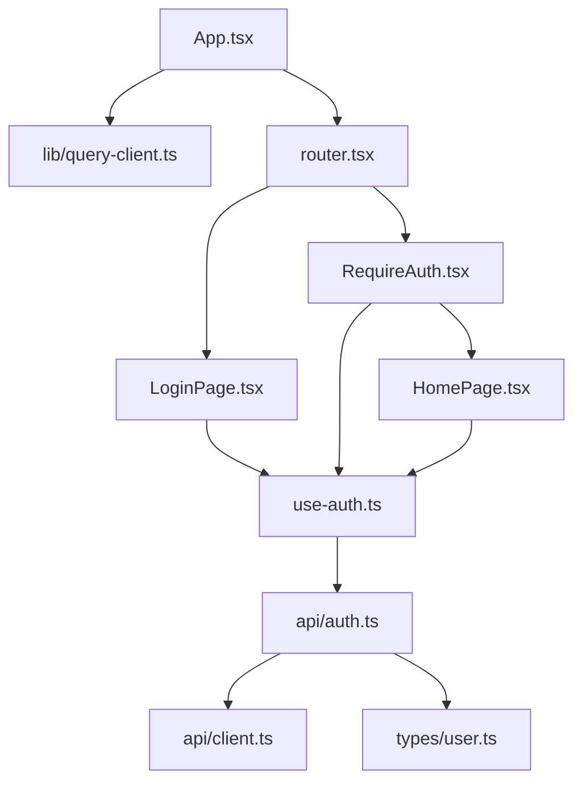

# Patch 06: Connect the login screen to the API

| | |
|---|---|
| **Screen** | Login (Admin portal): step 6 of 6 ✅ |
| **Part** | Frontend |
| **Commit** | `Patch 06: connect the login screen to the API` → `git show --stat ':/^Patch 06:'` |

## Where we are

Everything comes together: *Sign In* sends the form to the backend, a wrong login shows
the server's message, a correct one opens a (placeholder) start page, the session survives
a page reload, and *Log out* works. **The login screen is finished.**

```
Login screen
 ├── ✅ 01 Backend: first server
 ├── ✅ 02 Database and first admin user
 ├── ✅ 03 Login API + Postman
 ├── ✅ 04 Frontend: first page
 ├── ✅ 05 Login screen design
 └── ✅ 06 Connect the screen to the API    ← this patch
```

| Wrong password | Logged in |
|---|---|
|  |  |

## New concepts (read first)

[Frontend data flow](../concepts/frontend-data-flow.md): the layers (page → hook → API
function → client), axios, TanStack Query (queries, mutations, the cache), React Router
(routes, nesting, `Outlet`, `Navigate`, guards), and the whole login drawn as one diagram.

## Files in this patch (read in this order)

Bottom-up: from the HTTP call to the pages.

| # | File | New / changed | What it does | Explanation |
|---|---|---|---|---|
| 1 | `frontend/src/types/user.ts` | new | The `User` shape the backend sends | [read](../files/frontend/src/types/user.ts.md) |
| 2 | `frontend/src/api/client.ts` | new | The axios client + `apiErrorMessage` | [read](../files/frontend/src/api/client.ts.md) |
| 3 | `frontend/src/api/auth.ts` | new | `login`, `logout`, `me`: one function per endpoint | [read](../files/frontend/src/api/auth.ts.md) |
| 4 | `frontend/src/lib/query-client.ts` | new | The query cache | [read](../files/frontend/src/lib/query-client.ts.md) |
| 5 | `frontend/src/features/auth/use-auth.ts` | new | `useCurrentUser`, `useLogin`, `useLogout` | [read](../files/frontend/src/features/auth/use-auth.ts.md) |
| 6 | `frontend/src/components/FullPageLoader.tsx` | new | A centred spinner | [read](../files/frontend/src/components/FullPageLoader.tsx.md) |
| 7 | `frontend/src/features/auth/RequireAuth.tsx` | new | The guard for logged-in pages | [read](../files/frontend/src/features/auth/RequireAuth.tsx.md) |
| 8 | `frontend/src/features/home/HomePage.tsx` | new | Placeholder start page with Log out | [read](../files/frontend/src/features/home/HomePage.tsx.md) |
| 9 | `frontend/src/router.tsx` | new | URL → page | [read](../files/frontend/src/router.tsx.md) |
| 10 | `frontend/src/App.tsx` | changed | Providers: query cache + router | [read](../files/frontend/src/App.tsx.md) |
| 11 | `frontend/src/features/auth/LoginPage.tsx` | changed | Sends the form, shows server errors, redirects | [read](../files/frontend/src/features/auth/LoginPage.tsx.md) |
| – | `frontend/package.json` | changed | axios, TanStack Query, React Router, lucide icons | [read](../files/frontend/package.json.md) |

No backend changes: the frontend now uses the three endpoints you tested in Postman in patch 03.



## API → screen map

| Endpoint | Returns | Called by | Shown in |
|---|---|---|---|
| `GET /api/auth/me` | `{ user }` or 401 | `useCurrentUser()` → `authApi.me()` | `RequireAuth` (spinner → page or redirect), `HomePage` (name, email, role), `LoginPage` (redirect if already logged in) |
| `POST /api/auth/login` | `{ user }` + cookie, or 400/401/429 `{ error }` | `useLogin()` → `authApi.login()` | `LoginPage`: *Signing in…*, the red error box, then the redirect |
| `POST /api/auth/logout` | 204 | `useLogout()` → `authApi.logout()` | `HomePage`: *Log out* button |

## Trace a click: *Sign In* with the right password

1. **`LoginPage`**: `handleSubmit` runs the Zod check → OK → calls `onSubmit(values)`.
2. `login.mutateAsync(values)` → **`useLogin`** → `authApi.login(email, password)`.
3. **`api/client.ts`** (axios) sends `POST /api/auth/login` with a JSON body to Vite (5173).
4. **Vite's proxy** forwards it to the backend (3001).
5. **Backend**: `loginLimiter` → `loginSchema.parse` → `login()` in `auth.service.ts` →
   `SELECT … FROM users WHERE email = …` → bcrypt check → `createSessionToken` →
   `Set-Cookie: session=…; HttpOnly` → `200 { user }`.
6. The **browser** stores the cookie (page JavaScript can't read it).
7. **`useLogin.onSuccess`** writes the user into the cache under `['auth', 'me']`.
8. **`LoginPage`** calls `navigate('/')`.
9. The **router** matches `/` → `RequireAuth` → the cache already has the user → `<Outlet />`
   → **`HomePage`** shows *Welcome, Administrator*.

Then **reload the page**: the cache is empty again, so `RequireAuth` shows the spinner and
asks `GET /api/auth/me`. The browser sends the cookie, the backend's `requireAuth` finds
the user, and the page comes back. That's how the session survives reloads.

## Run it

Both servers, as in patch 04:

```bash
# Terminal 1                # Terminal 2
cd backend                  cd frontend
npm run dev                 npm install     # new packages
                            npm run dev
```

Open http://localhost:5173 and log in with `ADMIN_EMAIL` / `ADMIN_PASSWORD` from
`backend/.env` (`admin@example.com` / `ChangeMe123!` unless you changed them).

## Try it (with the developer tools open: F12)

1. **Network tab** (filter *Fetch/XHR*): open http://localhost:5173. You see `me` → 401,
   and the page moves to `/login`.
2. Log in with a **wrong password**: `login` → 401, red box *Invalid email or password*.
3. Log in correctly: `login` → 200. Click it → *Response*: `{ "user": … }`.
   *Headers* → `Set-Cookie`.
4. **Application tab → Cookies → localhost**: the `session` cookie, with a ✓ under
   *HttpOnly*. In the *Console*, type `document.cookie` → it's **not** listed. Scripts
   can't read it.
5. **Reload** the page: still logged in (`me` → 200, only **one** request: see
   [`staleTime`](../files/frontend/src/lib/query-client.ts.md)). You may see `304`
   instead of `200`: the browser asked "has this changed since last time?" (with an
   *ETag*, a fingerprint of the previous answer Express sent) and the server answered
   "no, use your copy". Same data, fewer bytes.
6. Type http://localhost:5173/login in the address bar: you're sent back to `/`.
7. Type http://localhost:5173/anything: you land on `/`.
8. **Log out**: `logout` → 204, back to `/login`. The cookie is gone from the Application tab.
9. Stop the backend and reload: *The server could not be reached* + *Try again*. Start it
   again and click *Try again*.
10. Trip the rate limiter: 21 wrong passwords → *Too many failed logins…*, straight from
    the server. (Restart the backend to reset it.)

> The red `401 (Unauthorized)` lines in the Console while you're logged out are the browser
> reporting failed requests. They're expected: `me` answers 401 when nobody is logged in.

## Check yourself

1. `RequireAuth`, `LoginPage` and `HomePage` all call `useCurrentUser()`. How many
   `GET /api/auth/me` requests does that cause, and why?
2. After a successful login, why doesn't the app call `/me` before showing the home page?
3. What would break if `QueryClientProvider` were placed *inside* `RouterProvider`'s pages
   instead of around it?
4. `RequireAuth` redirects to `/login` when nobody is logged in. Is that what protects the
   data? What does?
5. Why does logout call `queryClient.clear()`?

<details>
<summary>Answers</summary>

1. One. They all use the same query key `['auth', 'me']`, so they share one cached answer.
2. `useLogin`'s `onSuccess` already wrote the user from the login response into the cache
   under that key, so `RequireAuth` finds it there.
3. Any page calling `useQuery`/`useMutation` outside the provider fails with "No
   QueryClient set". Providers must wrap everything that uses them.
4. No. The guard only decides which page to show. The **backend's** `requireAuth` refuses
   every protected request without a valid session cookie, whatever the frontend does.
5. So nothing loaded for this user (later: projects, users…) stays in memory for the next
   person who logs in on the same browser.

</details>

## The login screen is done 🎉

You've built, end to end: a server, a database with a users table, a seeded admin, a
secure login API with a cookie session, a React app with a real login form, and the
connection between them.

**Next screen: the Admin portal shell.** The sidebar and top bar from the original app,
role-based menus, and the user menu with *Log out*, which then hold every admin page.
